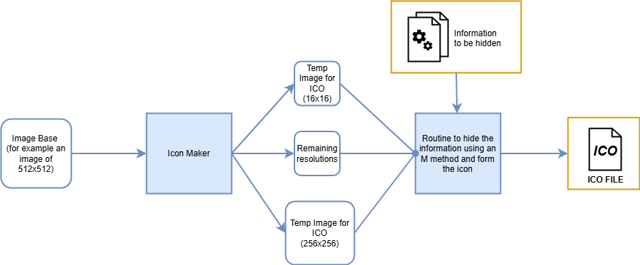
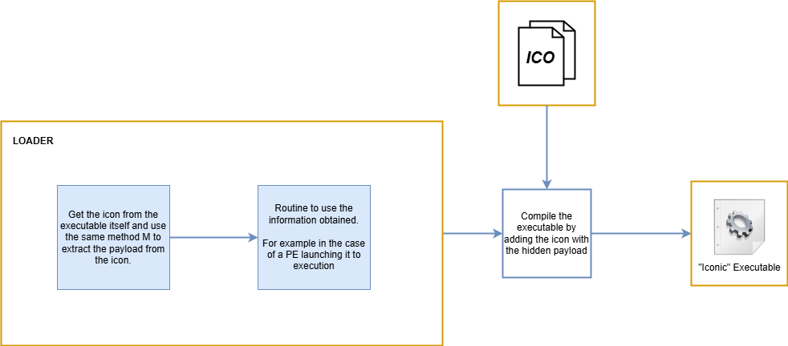

# Iconic

  

## Overview

Iconic is a tool for hiding information in icons following the format of the “.ico” structure.

Later, some “loader” routines are in charge of extracting that information from the icon of the executable itself, at run time,  to be able to use them in its execution.

This can obviously also be used with images from the resource area of an executable.

## Table of Contents

1. [How does it work?](#how-does-it-work)
2. [How can it be used?](#how-can-it-be-used)
3. [What about antivirus engines?](#what-about-antivirus-engines)
4. [Requeriments](#requirements)
5. [Limitations](#limitations)
6. [Is it only for executables?](#is-it-only-for-executables)
7. [Acknowledgments](#acknowledgments)

## How does it work?

Based on the structure of the ICO format, we can hide information with steganographic techniques in the images of different resolutions that make up the file. 

Therefore, we have the following scheme:

Once we have the icon with the hidden information:

We need a routine that is in charge of hiding the information and forming the icon automatically. In addition to another routine in charge of extracting the information and executing it at run time.

## How can it be used?

It can be used by the malware to hide the payload or information necessary for its operation, such as a password, addresses or something else to go unnoticed by the analyst. However, the limitations of this method must be taken into account.

It can also be used for other purposes typical of steganography.

## What about antivirus engines ?

I have done some tests with some malicious DLLs first in VirusTotal seeing how many detections it gave and then hiding it in the icon. **The result is that it decreases notably the detections**. You can try it for yourself!

It is curious because with the method used a stegoanalysis based on the frequency of the colors can be used and with the images used the anomaly is easily detected. 

However, the method can be complicated, avoiding this.

## Requirements

The requirements will depend on the language in which you want to program the routine to hide the information and the one in which you want to write the program that is in charge of extracting (and executing if it is a program) in memory the hidden information.

For the proof of concept, Python has been used to create the icon and hide the information. 

On the other hand, .NET features have been used to execute the PEF extracted from the icon using System.Reflection once extracted. Both tasks are performed by this “Loader”.

## Limitations

The maximum resolution we can store by definition of the ICO file is 256x256.

Suppose we apply 1Bit to each channel of an RGBA image (32Bits) using LSB Matching and taking into account that there is no transparency; With a small calculation, with this technique we could hide in 256x256 a total of 24KB. 

This could be increased if we divide the payload between the different images of different resolutions, with a routine that extracts the information image by image.

To give an example, the client built by the latest version of AsyncRAT occupies about 40KB; applying the above method but at 2 bits instead of 1, in the 256x256 image we could hide the client.

## Is it only for executables?

Actually, the beauty of it is that it doesn't. It depends on creativity; for example, it could be used to hide Windows command instructions. Then we create a routine to extract those commands and a loader to execute them by calling for example ShellExecute.

## Acknowledgments

+ Thanks to [Alfonso Muñoz](https://github.com/mindcrypt) for his great cybersecurity outreach; in this case for its dissemination on steganography and stegomalware.
+ Thanks to [Tsuda Kageuyu](https://github.com/TsudaKageyu/IconExtractor?tab=License-1-ov-file#readme) for its IconExtractor library that enhances the native C# functions and allows to extract high resolution images in the ICO format easily.